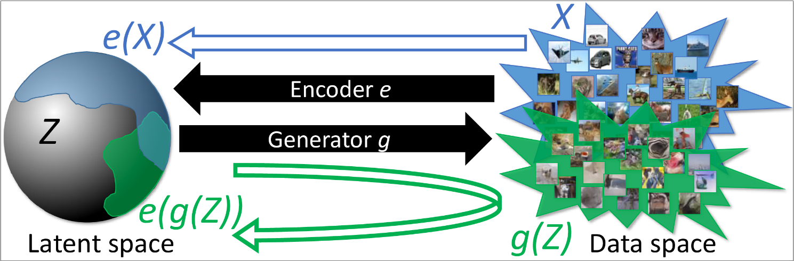
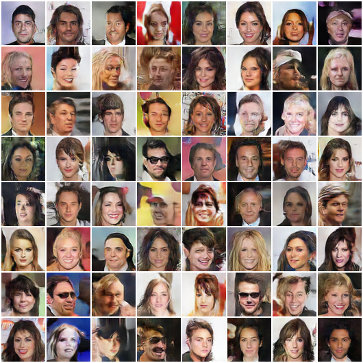
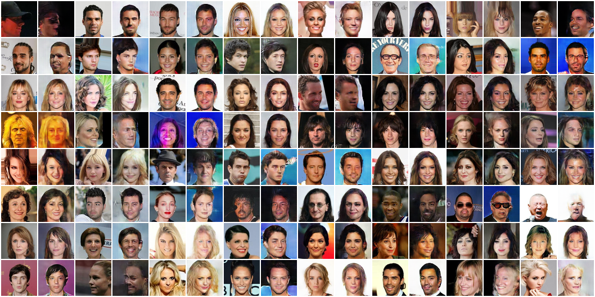
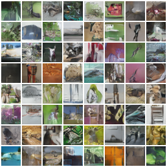
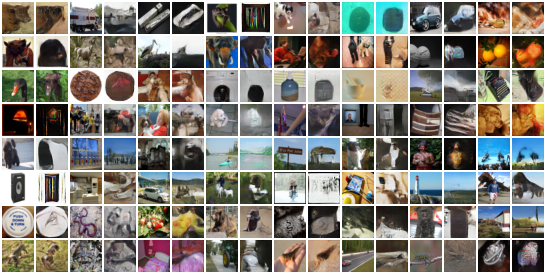

This repository contains code for the paper

["Adversarial Generator-Encoder Networks"](http://sites.skoltech.ru/app/data/uploads/sites/25/2017/04/AGE.pdf) by Dmitry Ulyanov, Andrea Vedaldi, Victor Lempitsky.



For now only evaluation code and the models from paper are here, training code will be added later this week.

## Pretrained models

1) First install dev version of pyTorch (see manual [here](INSTALL.md)) and make sure you have `jupyter notebook` ready.

2) Then download the models with the script:
```
bash download_pretrained.sh
```

3) Run `jupyter notebook` and go through `evaluate.ipynb`.


Here is an example of samples and reconstructions for `imagenet`, `celeba` and `cifar10` datasets.

#### Celeba

|Samples    |Reconstructions|
|:---------:|:-------------:|
| |  |

#### Cifar10

|Samples    |Reconstructions|
|:---------:|:-------------:|
| |  |

#### Tiny ImageNet

|Samples    |Reconstructions|
|:---------:|:-------------:|
| |  |
